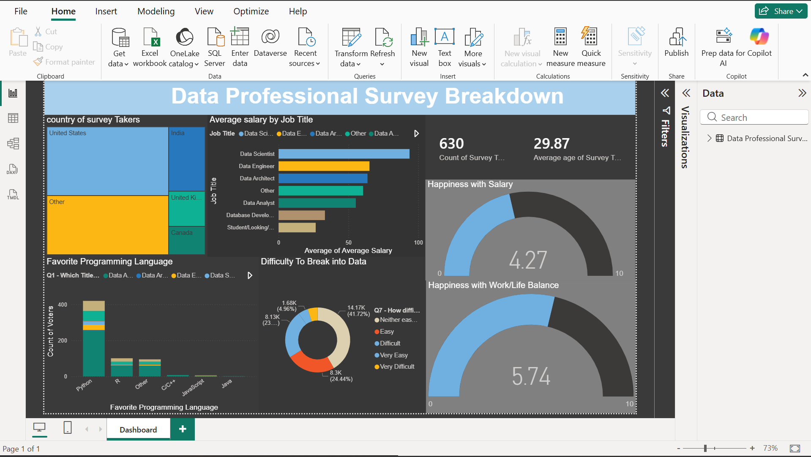

# Data Professional Survey Analysis

## 📊 Project Overview
This project analyzes survey responses from over 600 data professionals to understand the current landscape of the industry. Using Power BI, I transformed raw survey data into a dynamic dashboard that explores salary distributions, programming language preferences, and the challenges of breaking into the data field.

## 🎯 Business Objectives
* Identify the average salary ranges across different data roles (Data Analyst, Scientist, Engineer, etc.).
* Determine the most popular programming languages among industry professionals.
* Analyze job satisfaction levels concerning work-life balance and salary.
* Evaluate the perceived difficulty of breaking into the data industry based on career background.
* Visualize the global distribution of survey participants.

## 🛠️ Tech Stack & Skills
* **Tool:** Power BI Desktop
* **Data Transformation:** Used **Power Query** to clean inconsistent survey responses, handle null values, and group salary ranges for better visualization.
* **DAX Measures:** Created custom measures to calculate average age, count of participants, and satisfaction scores.
* **Data Modeling:** Established a clean star schema to connect survey responses with demographic categories.
* **Visualization:** Implemented **Gauge Charts** for satisfaction, **TreeMap** for programming languages, and **Clustered Bar Charts** for salary breakdowns.

## 🖼️ Dashboard Preview

## 📈 Key Insights
* **Programming Preferences:** Python remains the dominant language, followed closely by R and SQL, highlighting its versatility in the data ecosystem.
* **Salary Trends:** The majority of entry-level roles fall within the $40k–$60k range, while senior-level positions frequently exceed the $125k+ mark.
* **Industry Sentiment:** While "Work/Life Balance" generally receives high satisfaction scores, "Upward Mobility" is identified as a common area for improvement across many organizations.
* **Barriers to Entry:** Professionals transitioning from non-tech backgrounds reported a "Difficult" or "Very Difficult" experience breaking into the field compared to those with tech degrees.

## 💡 Final Recommendation
Aspiring data professionals should prioritize mastering Python and SQL, as these are the most sought-after skills according to the survey. Furthermore, companies looking to improve retention should focus on clear "Upward Mobility" paths, as this is a significant factor in overall job satisfaction for the modern data workforce.
